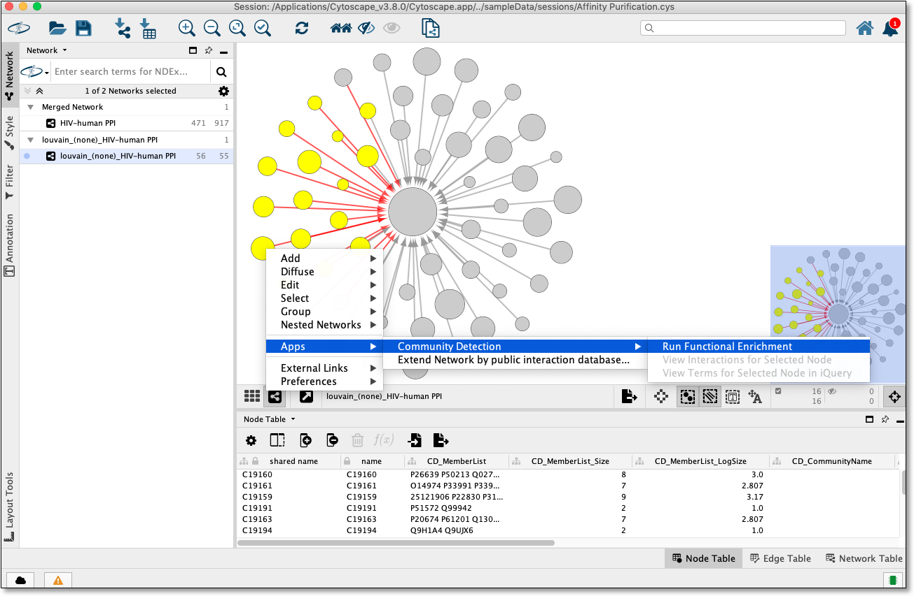
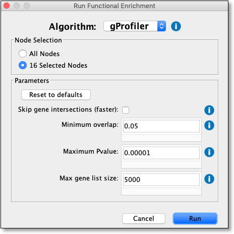
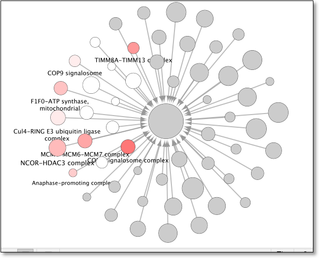

Quick Tutorial
==============

Open a network
--------------

To run Webby McSearch, a network must be loaded in Cytoscape.

From within Cytoscape click on **Affinity Purification** network
on the starter panel:

.. image:: images/quicktutorial/starterpanel.png
   :class: with-border with-shadow

If **not** displayed, the **Starter Panel** can
be displayed by invoking the menu option **View -> Show Starter Panel**.

   .. image:: images/quicktutorial/loadstarterpanel.png

Run a Web Search
--------------------

Using network/hierarchy generated above select a **single** node
in the network view and then right click on a selected node to display the submenu
and select **Apps -> Webby McSearch -> Web Search**
as seen here:

The above step will display a dialog seen below:

Select **gProfiler** from algorithm dropdown and click
**Run** button.

**gProfiler** will be run and nodes will be named and
colored according to overlap as seen here:

