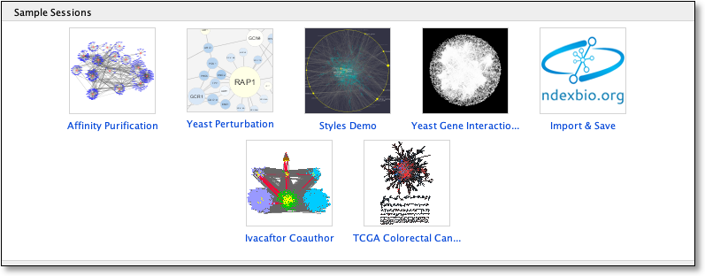
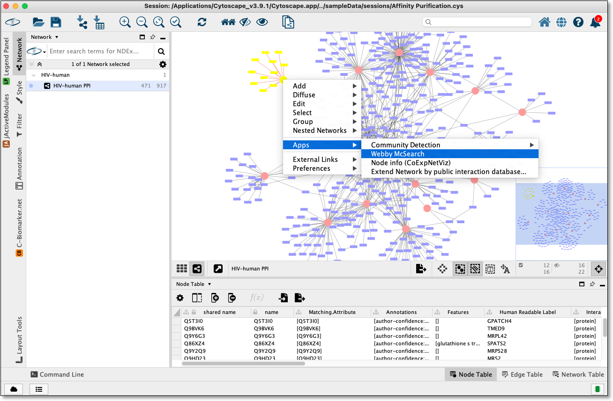
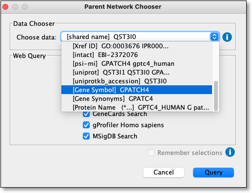
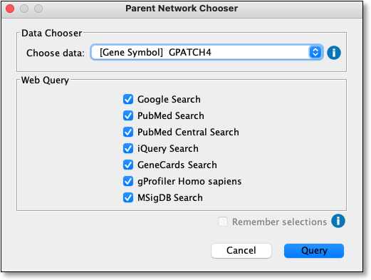
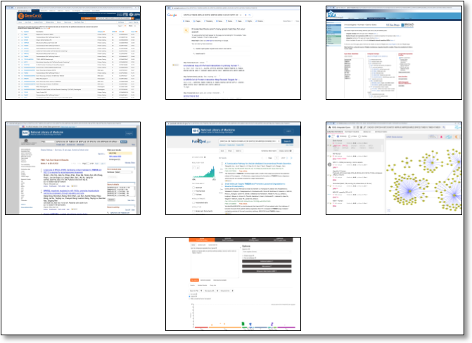

Quick Tutorial
==============

Open a network
--------------

To run Webby McSearch, a network must be loaded in Cytoscape.

From within Cytoscape click on **Affinity Purification** network
on the starter panel:

If **not** displayed, the **Starter Panel** can
be displayed by invoking the menu option **View -> Show Starter Panel**.

   .. image:: images/quicktutorial/loadstarterpanel.png

Run a Web Search
--------------------

Using network loaded above select one or more nodes
in the network view and then right click on a selected node to display the submenu
and select **Apps -> Webby McSearch -> Web Search**
as seen here:

The above step will display a dialog seen below:

Select **[Gene Symbol] XXXX** from Choose data dropdown

Review and check/uncheck websites to query and click the **Query** button
to submit a query:

The query should be run on websites specified in new tabs a default web
 browser

