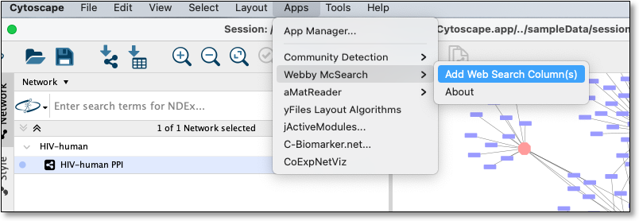
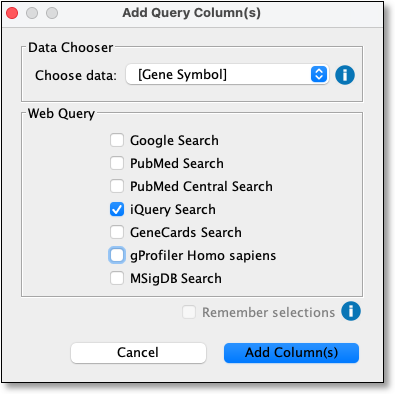
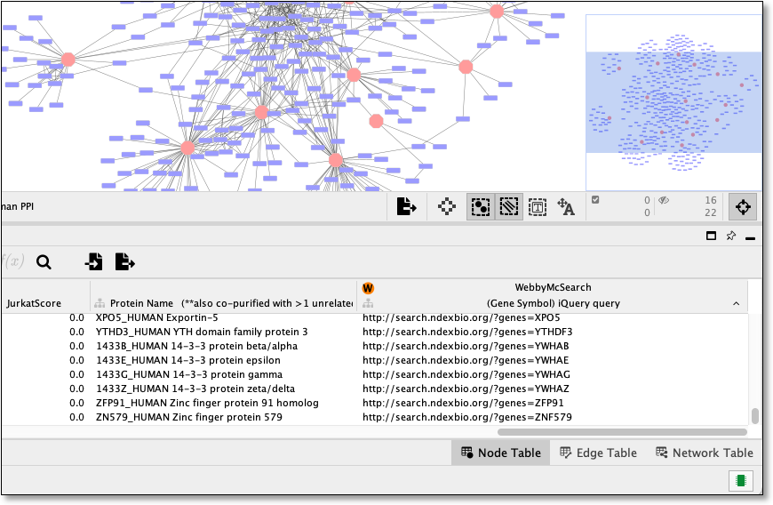

Quick Tutorial
==============

Open a network
--------------

To run Webby McSearch, a network must be loaded in Cytoscape.

From within Cytoscape click on **Affinity Purification** network
on the starter panel:

.. image:: images/quicktutorial/starterpanel.png
   :class: with-border with-shadow

If **not** displayed, the **Starter Panel** can
be displayed by invoking the menu option **View -> Show Starter Panel**.

   .. image:: images/quicktutorial/loadstarterpanel.png

Run a Web Search
--------------------

Using network loaded above select one or more nodes
in the network view and then right click on a selected node to display the submenu
and select **Apps -> Webby McSearch -> Web Search**
as seen here:

The above step will display a dialog seen below:

Select **[Gene Symbol] XXXX** from Choose data dropdown

Review and check/uncheck websites to query and click the **Query** button
to submit a query:

.. image:: images/quicktutorial/selectsitestoquery.png
   :class: with-border with-shadow

The queries will be displayed in new tabs on your default web browser:

Add Web Search Column(s)
---------------------------

Using network loaded above and displayed in the network view use the main
menu to select

**Apps -> Webby McSearch -> Add Web Search Column(s)**:

Select **[Gene Symbol] XXXX** from Choose data dropdown and unselect all
sites except **iQuery Search** and click **Add Columns(s)**:

Doing the above will add a new column named
**WebbyMcSearch::(Gene Symbol) iQuery query** to the node table and fill the values
with the webquery URL as seen here:

